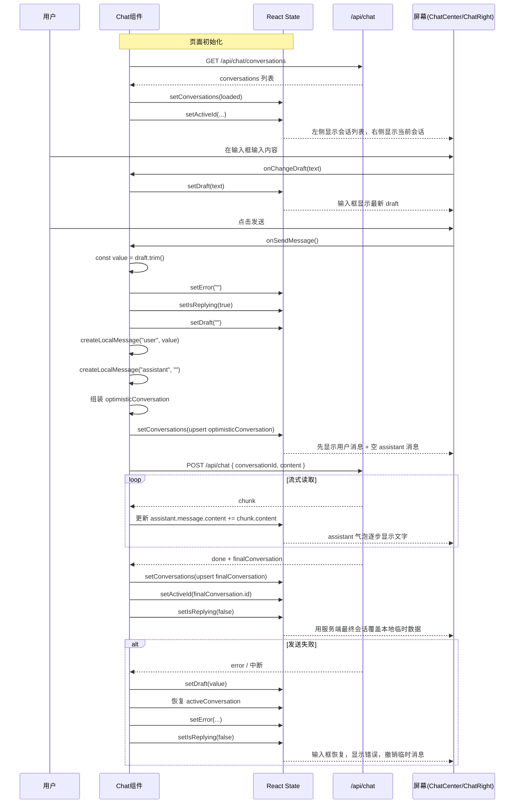
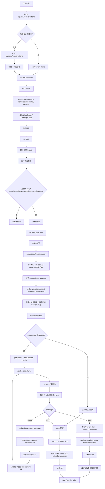

可以，我给你画两版：

1. **时序图**：看“谁先调用谁”
2. **流程图**：看“数据怎么流动、状态怎么变化”

我用的就是你这段 `Chat` 组件里的真实逻辑：初始化加载、`activeConversation` 派生、`handleSendMessage` 的 optimistic UI、流式 `chunk` 拼接、`done` 最终覆盖、失败回滚，以及最后把数据传给 `ChatCenter` / `ChatRight` 显示。

---

# 一、时序图

你可以把它理解成：

- **用户**
- **Chat 组件**
- **React state**
- **后端 API**
- **屏幕 UI**

这 5 个角色之间，消息是怎么一层层传递的。



---

# 二、流程图

这个更适合你看“数据状态到底经历了哪些节点”。



---

# 三、我再给你画一版“状态变化图”

这个最适合你理解：**同一份数据在不同时刻长什么样**。这部分和 `conversations / activeId / draft / isReplying / activeConversation` 的状态变化直接对应。

```text
【时刻 1：刚进入页面】
draft = ""
isReplying = false
conversations = [
  {
    id: "c1",
    title: "新的对话",
    messages: []
  }
]
activeId = "c1"

屏幕：
- 左边有一个会话
- 右边聊天区空白
- 输入框空白


        ↓ 用户输入


【时刻 2：输入框有内容】
draft = "帮我写一个学习 React 的七天计划"

屏幕：
- 输入框显示这段文字
- 其他不变


        ↓ 点击发送


【时刻 3：进入 optimistic UI】
draft = ""
isReplying = true
conversations = [
  {
    id: "c1",
    title: "帮我写一个学习 React",
    messages: [
      { id: "local-u1", role: "user", content: "帮我写一个学习 React 的七天计划" },
      { id: "local-a1", role: "assistant", content: "" }
    ]
  }
]

屏幕：
- 输入框清空
- 用户消息立刻显示
- assistant 出现一个空白消息位


        ↓ 后端流式返回 chunk


【时刻 4：chunk 1 到来】
assistant.content = "下面是一个"

屏幕：
- assistant 气泡显示：下面是一个


        ↓ chunk 2 到来


【时刻 5：chunk 2 到来】
assistant.content = "下面是一个 React 七天学习计划："

屏幕：
- assistant 内容继续增长


        ↓ chunk 3 到来


【时刻 6：chunk 3 到来】
assistant.content =
"下面是一个 React 七天学习计划：
第1天：JSX 和组件基础"

屏幕：
- 用户看到 AI 正在逐步输出完整内容


        ↓ done 到来


【时刻 7：最终服务端覆盖】
conversations = [
  {
    id: "c1",
    title: "帮我写一个学习 React",
    messages: [
      { id: "m1", role: "user", content: "帮我写一个学习 React 的七天计划" },
      { id: "m2", role: "assistant", content: "下面是一个 React 七天学习计划：\n第1天：JSX 和组件基础" }
    ]
  }
]
isReplying = false

屏幕：
- 内容看起来差不多
- 但底层已经从 local 临时消息，换成了服务端正式消息
```

---

# 四、把这三张图对应回代码

你看代码时，可以这样对号入座：

`useEffect -> loadConversations`
负责页面第一次进入时，去拿历史会话；如果没有会话，就创建一个。

`activeConversation = useMemo(...)`
负责从 `conversations + activeId` 里找出当前选中的会话，然后传给右边聊天区。

`handleSendMessage` 前半段
负责做发送前校验、清空 draft、设置 `isReplying`，并构造 `optimisticMessage`、`streamingAssistantMessage` 和 `optimisticConversation`。

`setConversations(upsertConversation(...))`
负责让左边会话列表和右边聊天区立刻同步更新，也就是 optimistic UI 的关键。

`reader.read() + decoder + buffer + split("\n")`
负责把流式响应拆成一个个事件。也就是：二进制数据 → 字符串 → 一行一行 JSON event。

`if (event.type === "chunk")`
负责不断把新文本拼接到那条本地 assistant 消息上。

`if (event.type === "done")`
负责用服务端最终 conversation 替换本地临时 conversation。

`catch`
负责失败时把 `draft` 恢复、把 conversation 回滚成发送前状态，并显示错误。

`return <ChatCenter ... /><ChatRight ... />`
负责把状态和事件传给两个子组件，最终显示到屏幕。

---

# 五、你可以这样记这一整套链路

一句话版：

**输入框文本**
→ `draft`
→ `value`
→ 本地 `user message + assistant 空 message`
→ `optimisticConversation`
→ `conversations`
→ `activeConversation`
→ `ChatRight`
→ 屏幕显示

然后后端流式回来的时候再走一条链：

**chunk**
→ `event`
→ `assistant.content += chunk`
→ `setConversations`
→ `activeConversation`
→ `ChatRight`
→ 屏幕逐字更新

最后：

**done**
→ `finalConversation`
→ 覆盖本地临时数据
→ 屏幕保持最终正式结果

---

# 六、如果你要背面试回答，可以直接说

这段聊天组件的渲染链路是：先由 `draft` 保存输入框内容，发送时在 `handleSendMessage` 里做 optimistic UI，把用户消息和一个空的 assistant 消息先插入 `conversations`，然后通过流式读取后端返回的 `chunk`，不断更新 assistant 消息的 `content`。由于 `activeConversation` 是从 `conversations` 和 `activeId` 派生出来的，所以每次 `setConversations` 后，`ChatRight` 都会拿到新数据并重新渲染，最终实现“消息先显示、AI 逐字输出、done 后再用服务端正式数据覆盖本地临时数据”的效果。

如果你要，我下一步可以继续给你画一版 **“带具体示例数据的流程图”**，把每一步的 `conversations` 数组内容都写出来。
